# KiepKeyboard

Fullscreen typing Android app for hardware USB keyboard. Designed as lightweight portable communication setup for disabled people.

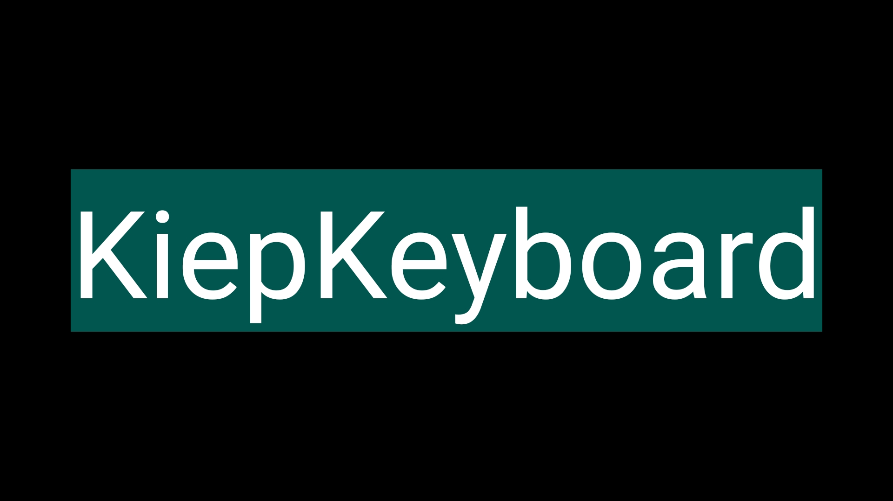

For betatesting latest changes apply here: https://play.google.com/apps/internaltest/4699439541078434612

## Hardware
[RL-K7 keyboard](https://www.aliexpress.com/item/4000336069065.html) with laser-cut acrylic glass grid frame overlay for typing support. The grid frame has an integrated phone stand. The keyboard has a modified cable; a short micro-USB OTG cable.

Download the DXF for laser cutting: [Raster_flat_0.21_kerf.dxf](Raster_flat_0.21_kerf.dxf)

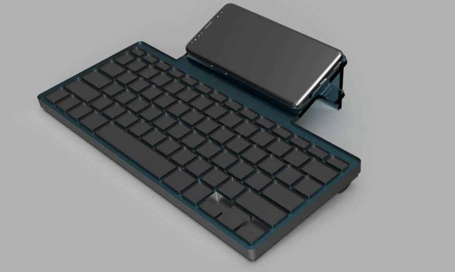

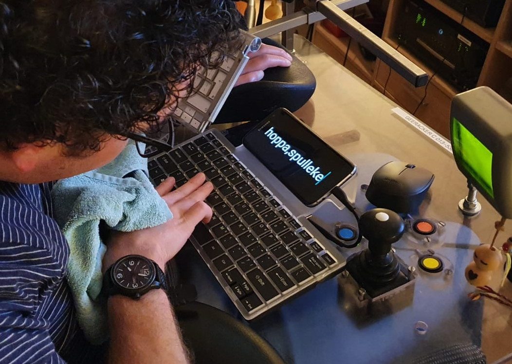

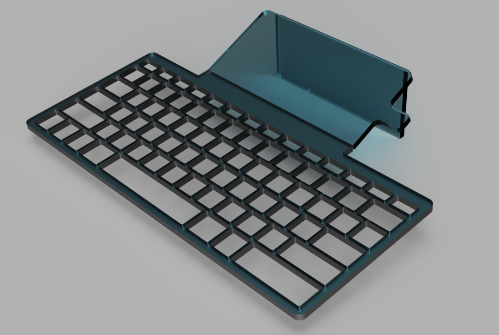

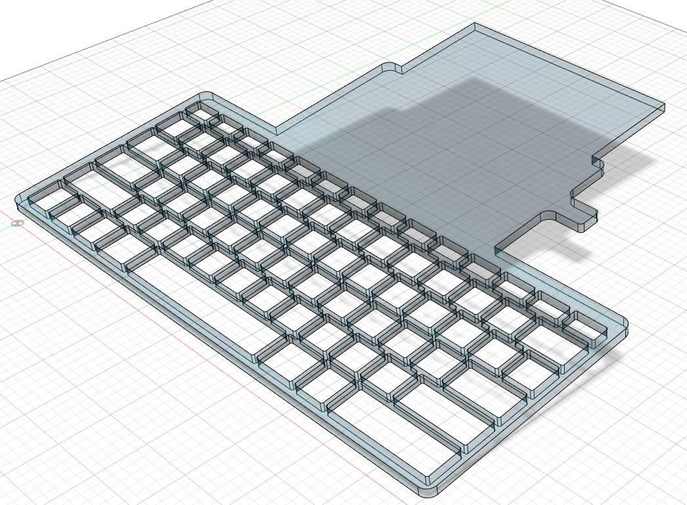

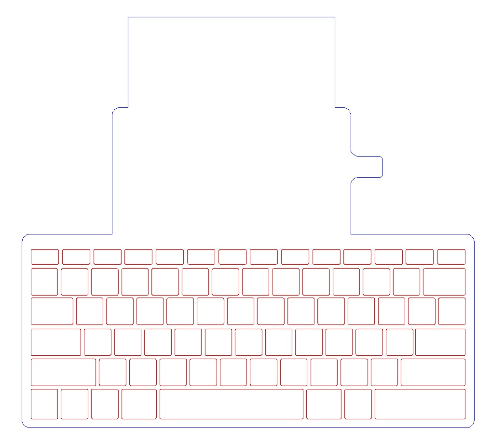

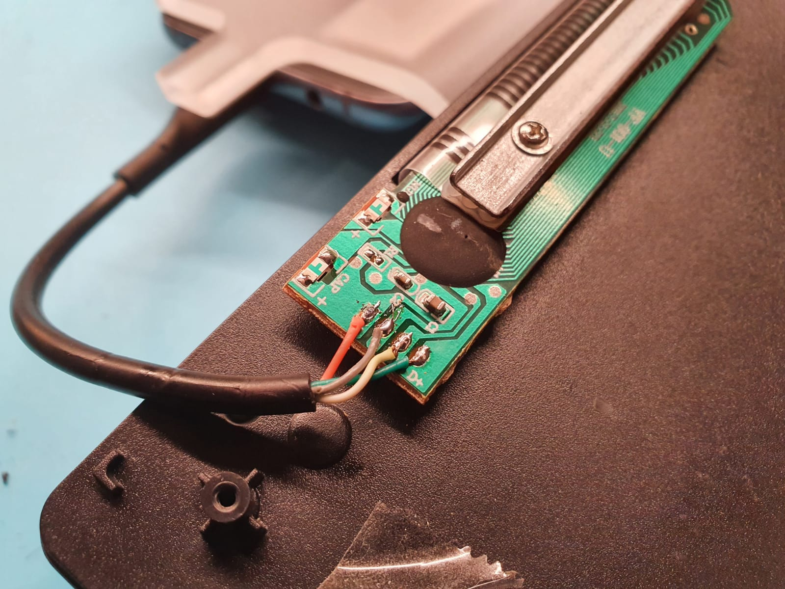

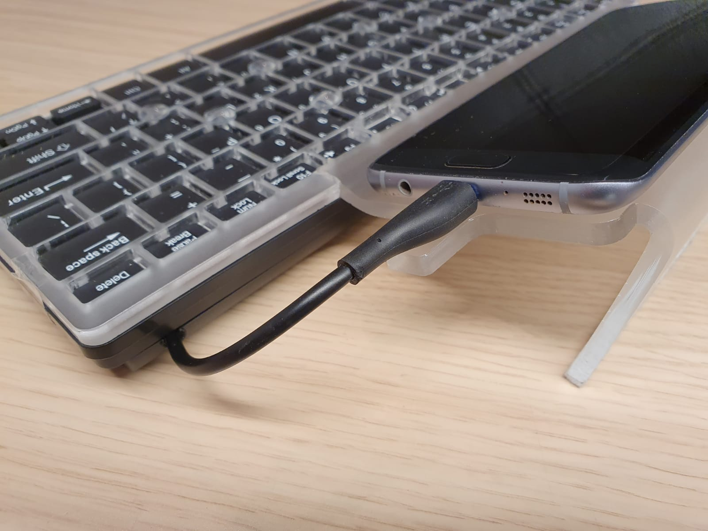

## Charging
The phone is charged wirelessly through the acrylic glass, using a special designed charging dock. The dock uses the internals of a [Samsung wireless charger](https://www.aliexpress.com/item/33001957782.html).

The STL for 3D printing: [Charge_dock.stl](Charge_dock.stl)

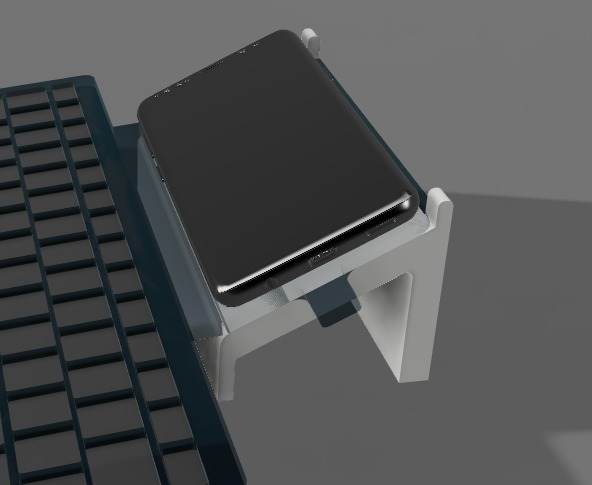

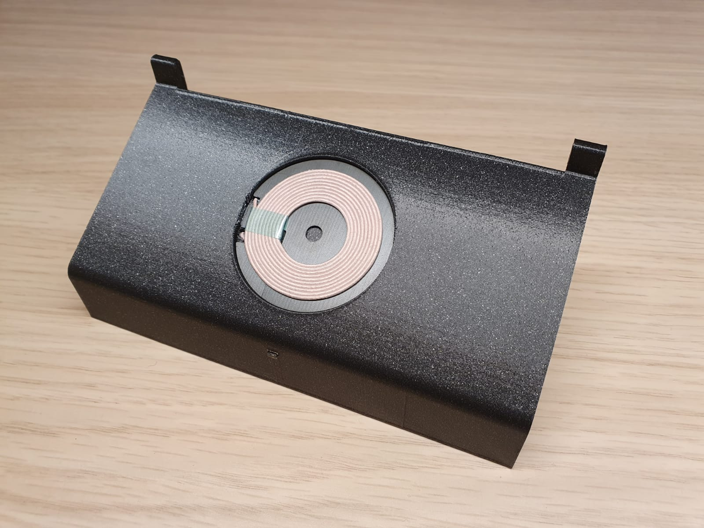

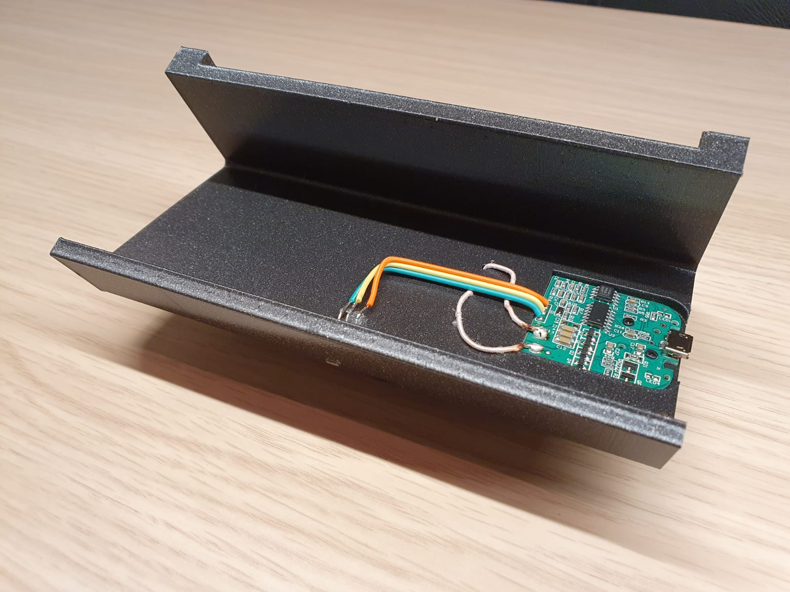

---
See [KiepProjects](https://github.com/Joozt/KiepProjects) for an overview of all Kiep projects.
